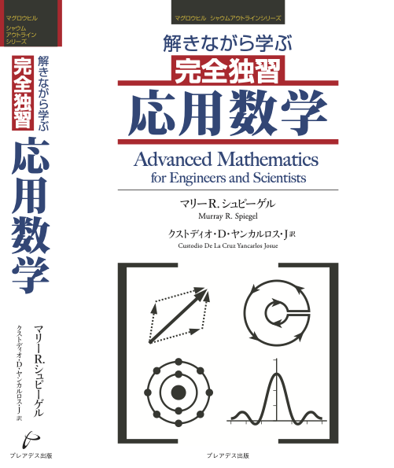

# 解きながら学ぶ 完全独習 応用数学

<kbd></kbd>

 
書籍『解きながら学ぶ  完全独習 応用数学(プレアデス, 2023)』のサポートページです

# 補足問題について
準備中

# 正誤表
本書の正誤情報は[こちら](https://github.com/sol-sun/advanced_mathematics/blob/main/eratta.md)．

# 本書の使い方(参考)
1. **本文パート** 
本書は「理論を学ぶための演習書」という立ち位置なので，本文はざっと眺める程度で結構です．「後から手を動かして理解していくんだ」というつもりで気楽に臨んでいきましょう．
特に「第2章 常微分方程式」「第3章 線形微分方程式」の本文パートは，公式が多く並んでいるので，この傾向が強いです．
2. **演習パート** 
積極的に答えを参照しながら，解いていってください．
いくつか演習問題が解き終わり，改めて本文パートの該当部分を見返せば
「こういうことを言いたかったのか」と納得いく場面が多いと思います．

### テーマごとの対応関係
- 章ごとの対応関係を作成しました．特定のテーマをまずは学びたい，という方にお役立ていただければと思います．
- 矢印(実線)は「矢印元の章の知識は必須」であることを表しています
- 矢印(点線)は「一部で矢印元の知識が使われているが，概要を抑えるには必ずしも必要ない」ことを表しています．
   - 例) 偏微分方程式(12章)の演習問題の一部に，ベッセル関数(10章)による解法が存在する．
- あくまで本書における対応関係であって，一般的な学問体系としての対応関係ではない，ことにご注意ください．

